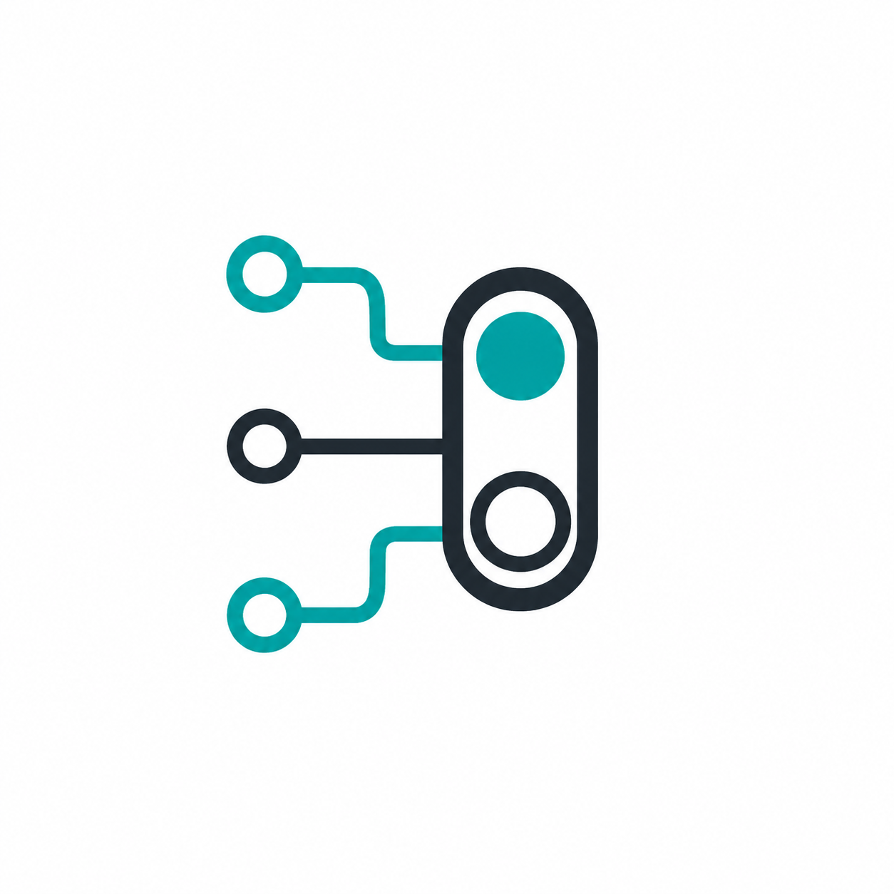

<div align="center">
  <div>
    
  </div>

  <h1 style="margin-top: 10px;">SwitchBoard</h1>

  <h2>Local command center for Codex accounts, sessions, usage, and image jobs.</h2>

  <div align="center">
    <a href="./LICENSE"></a>
    
    
    
    
  </div>

  <p>
    <a href="#latest-news">Latest News</a>
    ◆ <a href="#why-switchboard">Why SwitchBoard?</a>
    ◆ <a href="#quick-start">Quick Start</a>
    ◆ <a href="#demo">Demo</a>
    ◆ <a href="#installation">Installation</a>
    ◆ <a href="#architecture">Architecture</a>
  </p>

  <p><a href="./README.zh-CN.md">简体中文</a></p>
</div>

## Latest News

- **[2026/05]** Refactored the Images page into focused feature modules and local HeroUI-backed components.
- **[2026/05]** Added a paginated image gallery, per-image and per-job deletion, and responsive gallery page sizing.
- **[2026/05]** Unified persistent data configuration under `SWITCHBOARD_DATA_DIR`.

## Why SwitchBoard?

SwitchBoard gives local Codex users a protected dashboard for the operational details that are otherwise scattered across `CODEX_HOME`: active account state, saved credentials, session history, request logs, token usage, cost estimates, and queued image generation work.

- **Account control** - See known Codex accounts, scan current account limits, rename or hide accounts locally, and switch accounts by replacing `CODEX_HOME/auth.json`.
- **Session visibility** - Browse Codex sessions, search by text, inspect compact event previews, and open raw event details when needed.
- **Usage and cost review** - Aggregate request logs by account, model, cache usage, token class, and estimated USD cost.
- **Image job workspace** - Queue text-to-image and reference-image jobs, browse generated outputs in a paginated gallery, retry jobs, download images, and delete unwanted results.
- **Local-first security** - Keep ChatGPT tokens out of SQLite, protect the web UI with an app password, and store saved account credentials in a private auth vault.

## Quick Start

Run the backend and frontend in two terminals for day-to-day development.

```bash
# 1. Start the backend API
cd backend
APP_PASSWORD=switchboard \
CODEX_HOME="$HOME/.codex" \
SWITCHBOARD_DATA_DIR=./data/dev \
uv run uvicorn main:app --host 127.0.0.1 --port 8080 --reload
```

```bash
# 2. Start the frontend dev server
cd frontend
npm install
npm run dev
```

Open the Vite URL shown in the frontend terminal, usually `http://127.0.0.1:5173`, and sign in with the `APP_PASSWORD` value.

> **Prerequisites**: Python 3.13 with `uv`, Node.js with npm, and a local Codex home directory such as `~/.codex`.
>
> **Need one-command local packaging?** Use [Docker Compose](#docker-compose), or build the frontend and serve it from FastAPI with [Production-Style Local Run](#production-style-local-run).

## Demo

### Dashboard Preview

<div align="center">
  
</div>

### Typical Workflow

```text
Codex local files
  -> SwitchBoard scans accounts, sessions, and usage logs
  -> FastAPI serves authenticated APIs and the React app
  -> Browser dashboard shows accounts, usage, sessions, request logs, and images
```

What you can do from the UI:

- Scan the current Codex account and inspect 5-hour and weekly remaining quota.
- Switch to a saved account while preserving the existing `auth.json` file owner and private permissions.
- Search sessions, open event previews, and jump through paginated history.
- Filter request logs by account or unassigned bucket and review token/cost summaries.
- Create image jobs with aspect ratio, quality, count, and up to 4 reference images.

## Installation

This section covers detailed setup options. For the fastest development path, use [Quick Start](#quick-start).

### Environment Setup

Backend dependencies are managed by `uv` from `backend/`:

```bash
cd backend
uv sync
```

Frontend dependencies are managed by npm from `frontend/`:

```bash
cd frontend
npm install
```

### Configuration

The backend reads environment variables and also loads a `.env` file from the backend process working directory when present.

| Variable | Required | Description |
| --- | --- | --- |
| `APP_PASSWORD` | Yes | Password used to sign in to SwitchBoard. |
| `CODEX_HOME` | No | Codex home directory. Defaults to `/host-codex` when that Docker-style mount exists, otherwise `~/.codex`. The directory must exist at startup. |
| `SWITCHBOARD_DATA_DIR` | No | Persistent SwitchBoard data directory. Defaults to `/data` when present, otherwise `data` under the backend working directory. Stores `switchboard.sqlite`, `auth-vault/`, and `images/`. |
| `SWITCHBOARD_STATIC_DIR` | No | Built frontend directory served by FastAPI, usually `frontend/dist`. |
| `SWITCHBOARD_COOKIE_SECURE` | No | Controls the session cookie `Secure` flag. Defaults to `false` for local HTTP; set `true` behind HTTPS. |
| `CHATGPT_BACKEND_BASE` | No | ChatGPT backend base URL used for account scans and image proxy calls. Defaults to `https://chatgpt.com/backend-api`. |
| `SWITCHBOARD_IMAGE_MODEL` | No | Default image model. Defaults to `gpt-image-2`. |
| `SWITCHBOARD_IMAGE_RESPONSES_MODEL` | No | Responses API host model used to invoke image generation. Defaults to `gpt-5.4-mini`. |
| `SWITCHBOARD_IMAGE_RESPONSES_PATH` | No | Path or full URL for image Responses calls. Defaults to `/codex/responses`. |
| `SWITCHBOARD_IMAGE_TIMEOUT_SECONDS` | No | Image generation timeout. Defaults to `300`. |
| `SWITCHBOARD_IMAGE_MAX_PROMPT_CHARS` | No | Maximum accepted prompt length. Defaults to `4000`. |
| `SWITCHBOARD_IMAGE_DEBUG` | No | Enables image request/response debug logging. Defaults to `false`; tokens and image base64 payloads are still not logged. |

Root-level `.env.example` is intended for Docker Compose:

```bash
APP_PASSWORD=change-me
CODEX_HOME=~/.codex
DATA_DIR=./backend/data
CHATGPT_BACKEND_BASE=https://chatgpt.com/backend-api
```

> **Security Note**: Do not commit `.env`, SQLite databases, local Codex credentials, or generated private data. Legacy path variables `SWITCHBOARD_DB`, `SWITCHBOARD_AUTH_VAULT`, and `SWITCHBOARD_IMAGE_OUTPUT_DIR` have been removed; use `SWITCHBOARD_DATA_DIR`.

## Images

Open the Images page after signing in. SwitchBoard uses the current `CODEX_HOME/auth.json` ChatGPT access token in memory, so no image-specific key is configured in SwitchBoard or sent to the browser.

Typical workflow:

1. Enter a prompt, then choose aspect ratio, quality tier, and image count.
2. Optionally attach up to 4 PNG, JPEG, or WebP reference images, each up to 10 MB.
3. Submit the job. SwitchBoard queues it, polls for progress, and shows a toast when it finishes or fails.
4. Browse results in the gallery. Pages are counted by image tile, and page size adapts to the gallery viewport.
5. Preview, download, retry, delete individual outputs, or delete a whole job.

Operational notes:

- Supported aspect ratios are `1:1`, `3:4`, `4:3`, `9:16`, `16:9`, and `21:9`, mapped to low, medium, and high pixel sizes.
- Multi-image jobs are stored and displayed as separate gallery items.
- Upstream image requests use `store: false`; follow-up prompts should include the needed context or reference images.
- Generated images and saved references live under `SWITCHBOARD_DATA_DIR/images` and are served through authenticated `/api/images/files/{file_path}` URLs.
- Job metadata is stored in `SWITCHBOARD_DATA_DIR/switchboard.sqlite`. If SwitchBoard restarts while a job is running, that job is restored to queued state.

Browser-facing image endpoints:

| Endpoint | Use |
| --- | --- |
| `POST /api/images/jobs` | Queue an image generation job. |
| `GET /api/images/gallery?page=1&limit={page_size}` | Fetch lightweight gallery tiles. |
| `GET /api/images/jobs?page=1&limit=20` | Fetch lightweight job summaries for polling. |
| `GET /api/images/jobs/{job_id}` | Fetch full details for one job. |
| `DELETE /api/images/jobs/{job_id}/images/{image_index}` | Delete one generated output. |
| `DELETE /api/images/jobs/{job_id}` | Delete a whole job. |
| `POST /api/images/generations` | Run the direct synchronous generation endpoint. |

## Development Commands

Run backend commands from `backend/`:

```bash
uv run pylint --rcfile=.pylintrc .
uv run pytest
APP_PASSWORD=switchboard CODEX_HOME="$HOME/.codex" SWITCHBOARD_DATA_DIR=./data/dev uv run uvicorn main:app --host 127.0.0.1 --port 8080 --reload
```

Run frontend commands from `frontend/`:

```bash
npm install
npm run dev
npm run lint
npm run build
npm run preview
```

`uv run pylint --rcfile=.pylintrc .` runs backend lint checks. `uv run pytest` runs focused backend tests. `npm run lint` runs frontend ESLint and TypeScript checks. `npm run build` creates `frontend/dist`.

## Production-Style Local Run

Build the frontend:

```bash
cd frontend
npm install
npm run build
```

Then serve both API and built frontend from FastAPI:

```bash
cd ../backend
APP_PASSWORD=switchboard \
CODEX_HOME="$HOME/.codex" \
SWITCHBOARD_DATA_DIR=./data/dev \
SWITCHBOARD_STATIC_DIR="$PWD/../frontend/dist" \
uv run uvicorn main:app --host 127.0.0.1 --port 8080
```

Open `http://127.0.0.1:8080` and sign in with `APP_PASSWORD`.

## Docker Compose

Create `.env` in the repository root:

```bash
APP_PASSWORD=change-me
CODEX_HOME=/home/you/.codex
DATA_DIR=./backend/data
```

Then run:

```bash
docker compose up --build
```

Open `http://127.0.0.1:8080` unless you set a different `PORT`.

Compose uses `.env` for interpolation. The host Codex directory is mounted read-write at `/host-codex`, and the host SwitchBoard data directory is mounted at `/data`. The container fixes `CODEX_HOME=/host-codex`, `SWITCHBOARD_DATA_DIR=/data`, and serves the built frontend from `/app/frontend/dist`.

The container process may run as root, but SwitchBoard preserves the existing owner and group of `CODEX_HOME/auth.json` when replacing it. If the Codex mount is read-only, Docker mode is limited to viewing accounts, sessions, usage, and image history that does not require writing credentials.

## Config Import and Export

Use the import and export buttons in the Accounts toolbar to move SwitchBoard-local account display state between installs.

The exported JSON includes account IDs, generated display names, custom names, hidden status, user and plan labels, expired status, last scan time, 5-hour remaining, weekly remaining, and reset times. It does not include ChatGPT tokens, `auth.json`, sessions, request logs, SQLite usage caches, image files, or `.env` values.

Import merges by `account_id`: accounts in the file update local display metadata and latest rate-limit snapshots, unknown accounts are created as placeholders, and local accounts missing from the file are left unchanged. The current Codex account is never imported as hidden, and importing a `current` marker never switches the active Codex account.

## Architecture

### System Overview

```text
┌─────────────────────────────────────────────────────────────┐
│ Browser                                                     │
│ React 19 + Vite + Tailwind CSS + HeroUI-backed wrappers     │
└─────────────────────────────┬───────────────────────────────┘
                              │ authenticated /api requests
                              ▼
┌─────────────────────────────────────────────────────────────┐
│ FastAPI backend                                              │
│ Login cookie, account APIs, session APIs, usage APIs, images │
└───────────────┬───────────────────────┬─────────────────────┘
                │                       │
                ▼                       ▼
┌────────────────────────────┐  ┌─────────────────────────────┐
│ CODEX_HOME                 │  │ SWITCHBOARD_DATA_DIR         │
│ auth.json, sessions, logs  │  │ SQLite, auth-vault, images   │
└────────────────────────────┘  └─────────────────────────────┘
                │                       │
                └──────────────┬────────┘
                               ▼
┌─────────────────────────────────────────────────────────────┐
│ ChatGPT backend                                              │
│ Account scans and OpenAI Images-compatible generation proxy  │
└─────────────────────────────────────────────────────────────┘
```

### Key Design Decisions

- **Flat FastAPI modules**: Backend behavior is organized by domain modules in `backend/` instead of a deep framework hierarchy.
- **Local metadata boundary**: SwitchBoard metadata lives in SQLite, while ChatGPT tokens stay in `auth.json` files and are never stored in the database.
- **Persistent image queue**: Image jobs are persisted in SQLite and files are stored under the data directory, so gallery state survives restarts.
- **HeroUI-backed frontend primitives**: The React app uses local wrappers around HeroUI where available, with SwitchBoard-specific composition in pages and feature modules.

## Repository Layout

```text
backend/
  main.py             FastAPI app and API routes
  accounts.py         Codex account scanning and switching
  images/             Image generation package, queue, storage, and API proxy
  sessions.py         Codex session reading and event previews
  usage.py            Usage aggregation and request logs
  db.py               SQLite setup and helpers
  security.py         Login cookie helpers
  tests/              Backend tests

frontend/
  src/app/            App shell and routing
  src/pages/          Dashboard, sessions, request logs, login, and images
  src/features/       Account, session, usage, and image UI modules
  src/components/     Shared UI components and HeroUI wrappers
  src/lib/            API client, errors, and utilities
  dist/               Built frontend output

docs/images/          Logo source and dashboard screenshot
```

## Security Notes

- SwitchBoard reads `auth.json` plus local Codex session and state files from `CODEX_HOME`.
- ChatGPT tokens are not stored in SwitchBoard's SQLite database.
- Saved account credentials live in `SWITCHBOARD_DATA_DIR/auth-vault` as private `auth.json` files, not under `CODEX_HOME` by default.
- Account switching rewrites local `CODEX_HOME/auth.json`; restart Codex for the change to take effect.
- Docker account switching preserves the existing `auth.json` owner/group and writes the file with `0600` permissions.
- Hidden accounts and custom names are SwitchBoard-local metadata.
- Config export includes only SwitchBoard-local account display state and never includes credentials.
- Image generation reads the current access token only in memory; tokens are never returned to the frontend.
- Image debug logging never prints the access token, Authorization header value, or image base64 payloads.
- Do not commit `.env`, SQLite databases, generated private data, or local Codex credentials.
- Usage cost estimates use a local pricing table for known model names; unknown model costs remain null.

## Contributing

Contributions are welcome. Keep changes focused and preserve the local-first credential boundary.

```bash
# Backend checks
cd backend
uv run pylint --rcfile=.pylintrc .
uv run pytest

# Frontend checks
cd ../frontend
npm run lint
npm run build
```

Commit messages use Conventional Commits: `<type>(<scope>): <summary>`. This repository prefers Chinese summaries unless the surrounding change is already English-only.

## License

SwitchBoard is licensed under the **MIT License**. See [LICENSE](LICENSE) for details.

## Acknowledgments

SwitchBoard exists for people running Codex locally who want a clearer, safer, and more inspectable workspace around their accounts and usage.
