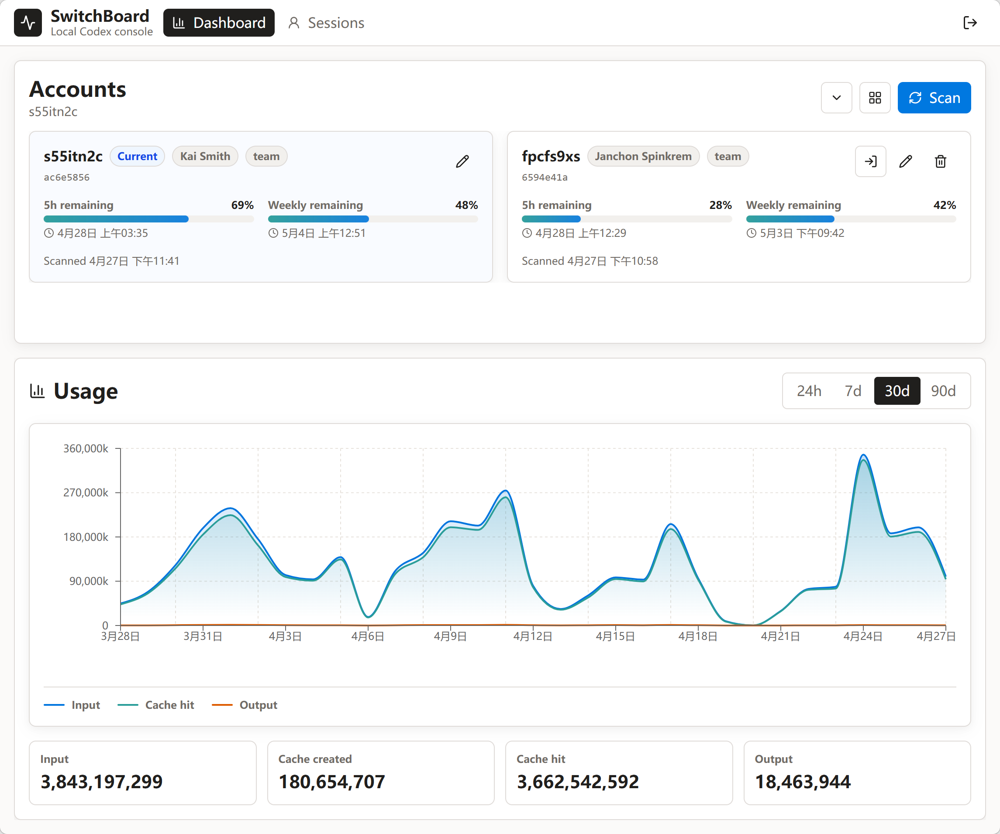

# SwitchBoard

Codex 账号、会话和用量的本地仪表盘。

[English](README.md)

SwitchBoard 是一个小型全栈应用，适合在本地使用 Codex、并希望更清楚查看账号状态、近期会话和 Token 用量的人。它从 `CODEX_HOME` 读取本地 Codex 文件，把 SwitchBoard 自己的元数据写入 SQLite，并通过 FastAPI 后端提供 React 仪表盘。

## 功能

- 查看本地 Codex 账号和当前生效账号。
- 从 ChatGPT 后端扫描账号资料和速率限制快照。
- 通过更新 `CODEX_HOME/auth.json` 切换本地 Codex 账号。
- 在 SwitchBoard 内重命名或隐藏账号，不修改 Codex 凭据本身。
- 导出和导入本地账号展示状态，方便在不同安装之间迁移 SwitchBoard 设置。
- 浏览 Codex 会话，按文本搜索，并查看会话事件。
- 查看请求日志、Token 用量、缓存用量和预估成本。
- 界面会根据浏览器语言默认显示英文或简体中文，并可在登录页和应用头部手动切换。
- 支持后端/前端分离开发、本地类生产运行，以及 Docker Compose 运行。

## 预览



## 环境要求

- 后端需要 Python 3.13 和 `uv`。
- 前端需要 Node.js 和 npm。
- 需要一个本地 Codex home 目录，通常是 `~/.codex`。

## 快速开始

日常开发时，建议分别在两个终端启动后端和前端。

终端 1，启动后端 API：

```bash
cd backend
APP_PASSWORD=switchboard \
CODEX_HOME="$HOME/.codex" \
SWITCHBOARD_DB=/tmp/switchboard-dev.sqlite \
uv run uvicorn main:app --host 127.0.0.1 --port 8080 --reload
```

终端 2，启动前端开发服务器：

```bash
cd frontend
npm install
npm run dev
```

打开前端终端里显示的 Vite 地址，通常是 `http://127.0.0.1:5173`，然后使用 `APP_PASSWORD` 的值登录。

在这个模式下：

- Vite 会热更新前端改动。
- Uvicorn 的 `--reload` 会在 Python 文件变化后重启后端。
- Vite 会把 `/api` 请求代理到 `http://127.0.0.1:8080`。

## 配置

后端从环境变量读取配置。如果后端进程的工作目录里存在 `.env` 文件，也会读取它。

| 变量 | 是否必需 | 说明 |
| --- | --- | --- |
| `APP_PASSWORD` | 是 | 登录 SwitchBoard 使用的密码。 |
| `CODEX_HOME` | 否 | Codex home 目录。在类似 Docker 的环境中如果存在 `/host-codex` 则默认使用它，否则默认使用 `~/.codex`。启动时该目录必须存在。 |
| `SWITCHBOARD_DB` | 否 | SQLite 数据库路径。如果 `/data` 存在则默认使用 `/data/switchboard.sqlite`；从 `backend/` 运行时默认使用 `backend/data/switchboard.sqlite`。 |
| `SWITCHBOARD_STATIC_DIR` | 否 | 后端要托管的已构建前端目录，通常是 `frontend/dist`。 |
| `SWITCHBOARD_COOKIE_SECURE` | 否 | 控制会话 Cookie 的 `Secure` 标记。本地 HTTP 开发默认是 `false`；部署在 HTTPS 后面时设为 `true`。 |
| `CHATGPT_BACKEND_BASE` | 否 | 扫描账号限制时使用的 ChatGPT 后端基础地址，默认是 `https://chatgpt.com/backend-api`。 |

本地开发时，`/tmp/switchboard-dev.sqlite` 是一个方便丢弃的数据库路径。

如果 `CODEX_HOME` 不存在，或者指向的是文件而不是目录，SwitchBoard 会在启动时快速失败并给出明确错误。

## 开发命令

在 `backend/` 目录运行后端命令：

```bash
uv run pytest
APP_PASSWORD=switchboard CODEX_HOME="$HOME/.codex" SWITCHBOARD_DB=/tmp/switchboard-dev.sqlite uv run uvicorn main:app --host 127.0.0.1 --port 8080 --reload
```

在 `frontend/` 目录运行前端命令：

```bash
npm install
npm run dev
npm run lint
npm run build
npm run preview
```

`npm run lint` 会运行 TypeScript 检查。`npm run build` 会生成 `frontend/dist`。

## 本地类生产运行

先构建前端：

```bash
cd frontend
npm install
npm run build
```

然后由后端同时提供 API 和已构建的前端：

```bash
cd ../backend
APP_PASSWORD=switchboard \
CODEX_HOME="$HOME/.codex" \
SWITCHBOARD_DB=/tmp/switchboard-dev.sqlite \
SWITCHBOARD_STATIC_DIR="$PWD/../frontend/dist" \
uv run uvicorn main:app --host 127.0.0.1 --port 8080
```

打开 `http://127.0.0.1:8080`，并使用 `APP_PASSWORD` 登录。

## 配置导入和导出

使用 Accounts 工具栏里的导入和导出按钮，可以在不同安装之间迁移 SwitchBoard 本地账号展示状态。

导出的 JSON 包含账号 ID、生成的显示名、自定义名称、隐藏状态、用户和套餐标签、过期状态、最近扫描时间、5h remaining、Weekly remaining 以及 reset 时间。它不包含 ChatGPT Token、`auth.json`、会话、请求日志、SQLite 用量缓存或 `.env` 值。

导入配置文件时会按 `account_id` 合并：文件中的账号会更新本地展示元数据和最新额度快照，未知账号会创建为占位账号，本地存在但文件中缺失的账号保持不变。当前 Codex 账号永远不会被导入为隐藏状态，导入 `current` 标记也不会切换当前 Codex 账号。

## Docker Compose

在仓库根目录创建 `.env`：

```bash
APP_PASSWORD=change-me
HOST_CODEX_HOME=/home/you/.codex
```

然后运行：

```bash
docker compose up --build
```

除非你设置了不同的 `PORT`，否则打开 `http://127.0.0.1:8080`。

Codex 目录会以只读方式挂载到 `/host-codex`。SwitchBoard 的 SQLite 数据会存储在 `switchboard_data` volume 中。

由于默认 Compose 挂载是只读的，Docker 模式更适合查看账号、会话和用量。账号切换需要对 `CODEX_HOME/auth.json` 有写入权限；如果想在容器内切换账号，请使用上面的本地后端命令，或有意地把挂载改为可写。

## 仓库结构

```text
backend/
  main.py            FastAPI 应用和 API 路由
  accounts.py        Codex 账号扫描与切换
  sessions.py        Codex 会话读取
  usage.py           用量聚合和请求日志
  db.py              SQLite 初始化和辅助函数
  security.py        登录 Cookie 辅助函数
  tests/             后端测试

frontend/
  src/App.tsx        React 主应用
  src/app/           应用外壳和路由
  src/pages/         仪表盘、会话和请求日志页面
  src/features/      账号、会话和用量 UI
  src/lib/           共享客户端辅助函数
  src/components/ui/ UI 基础组件
  dist/              已构建前端输出
```

## 安全说明

- SwitchBoard 会从 `CODEX_HOME` 读取 `auth.json` 和本地 Codex 会话/状态文件。
- ChatGPT Token 不会存储在 SwitchBoard 的 SQLite 数据库中。
- 切换账号会重写本地 Codex 的 `auth.json`；需要重启 Codex 才会生效。
- 隐藏账号和自定义名称都是 SwitchBoard 本地元数据。
- 配置导出只包含 SwitchBoard 本地账号展示状态，绝不会包含凭据。
- 不要提交 `.env`、SQLite 数据库或本地 Codex 凭据。
- 用量成本估算使用本地价格表匹配已知模型名；未知模型的成本会保持为 null。

## 许可证

MIT
